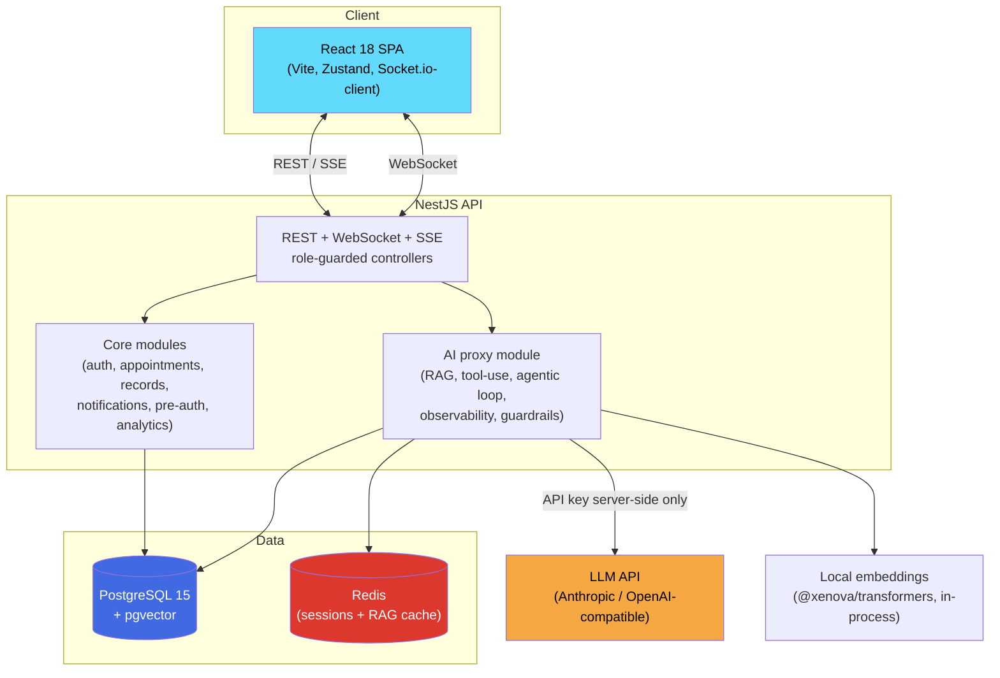

# SmartClinic — AI-Augmented Outpatient Management Platform

[](https://github.com/muhammadmoeed1/SmartClinic/actions/workflows/ci.yml)
[](LICENSE)
[](https://www.typescriptlang.org/)
[](https://nestjs.com/)
[](https://react.dev/)
[](https://github.com/pgvector/pgvector)

A full-stack outpatient clinic platform for four roles (patient, doctor, receptionist, admin) with four AI features built as a real AI *system*, not a thin API wrapper: **retrieval-augmented generation** over a clinic knowledge base and patient history, **tool-use/function-calling** for structured output, an **agentic** intake chatbot, **token-streamed** responses, per-call **observability** (latency/cost/tokens), an **LLM-as-judge eval harness**, and **guardrails** (PII redaction, hallucination checks) — all gracefully degrading to manual fallbacks when no AI key is configured.

Stack: **React 18 + TypeScript** frontend, **NestJS** backend, **PostgreSQL 15 + pgvector**, **Redis**, **Socket.io**, **JWT auth**, and a provider-agnostic **AI proxy** (Anthropic Claude / any OpenAI-compatible endpoint, e.g. Groq's free tier).

The entire application (database + backend) runs in **Docker**, so no manual database installation or configuration is required.

> **Live demo:** _(add your Vercel URL here after deploying — see [DEPLOYMENT.md](DEPLOYMENT.md))_

**Verified, not just built:** this isn't a described-but-untested feature list. CI runs 16 backend test suites, a Playwright E2E suite against real Postgres/Redis service containers, and an LLM eval harness — all green. A sample real run against Groq's `llama-3.3-70b-versatile`:

| Metric | Result |
|---|---|
| Specialty recommendation accuracy | **100%** (10/10 curated cases) |
| LLM-as-judge rationale quality | **5.00 / 5** average |
| SOAP note structural validity | **100%** (3/3 curated cases) |

Reproduce it yourself: `cd backend && npm run eval` (needs `AI_API_KEY`; see [Testing](#testing)).

---

## Architecture



No LLM API key is ever sent to the frontend — every AI call is proxied through the backend, role-guarded like any other endpoint. See [docs/AI_INTEGRATION.md](docs/AI_INTEGRATION.md) for the AI subsystem's internal architecture (RAG, tool-use, the agentic loop, observability, caching, and the eval harness).

---

## Table of Contents

- [Architecture](#architecture)
- [Prerequisites](#prerequisites)
- [Quick Start (Recommended)](#quick-start-recommended)
- [Demo Accounts](#demo-accounts)
- [Repository Layout](#repository-layout)
- [Core Modules](#core-modules)
- [AI Features](#ai-features)
- [Production Hardening](#production-hardening)
- [Environment Variables](#environment-variables)
- [Alternative: Manual Backend Setup (without Docker)](#alternative-manual-backend-setup-without-docker)
- [Testing](#testing)
- [Troubleshooting](#troubleshooting)
- [Project Origin](#project-origin)

---

## Prerequisites

Install the following before running the project. Both are free.

| Software | Version | Download Link |
|---|---|---|
| Node.js | 20.x (LTS) | https://nodejs.org |
| Docker Desktop | Latest | https://www.docker.com/products/docker-desktop |

> **Windows users:** Docker Desktop requires **WSL 2**. If you see a "WSL needs updating" error when Docker first opens, open PowerShell **as Administrator** and run:
> ```powershell
> wsl --update
> ```
> Then restart your computer and reopen Docker Desktop.

After installing, confirm both are working by opening a terminal and running:

```bash
node -v
docker -v
```

Both commands should print a version number. If either fails, revisit the installation step above.

**Docker Desktop must be open and running (Engine running, shown at the bottom-left of the app) before proceeding to the next section.**

---

## Quick Start (Recommended)

This is the fastest and most reliable way to run the project — everything except the frontend runs inside Docker containers, so there is nothing to configure manually.

### 1. Clone the repository

```bash
git clone https://github.com/muhammadmoeed1/SmartClinic.git
cd SmartClinic
```

### 2. Open the project folder in a terminal

Open the folder in **VS Code**, then open a terminal inside VS Code:
`Terminal → New Terminal` (or `` Ctrl + ` ``).

Confirm you're in the right place by running:

```bash
dir        # Windows
ls         # macOS/Linux
```

You should see `backend`, `frontend`, `docs`, `docker-compose.yml`, and `README.md`.

### 3. Start the database and backend

```bash
docker compose up -d
```

The first run will take a few minutes as Docker downloads the PostgreSQL image and builds the backend. When finished, you should see:

```
✔ Container smartclinic-db    Healthy
✔ Container smartclinic-api   Started
```

This automatically:
- Starts PostgreSQL 15 on port `5432`
- Builds and starts the NestJS backend on **http://localhost:3000** (Swagger docs at `/api`)
- Runs database migrations automatically on startup

### 4. Seed the database (demo accounts + sample data)

The database tables exist after step 3, but they are **empty** until you seed them. Run:

```bash
docker exec -it smartclinic-api node dist/database/seed.js
```

You should see:

```
Seed complete.
Users: 1 admin, 1 receptionist, 12 doctors, 8 patients (password: Password1!)
```

> This only needs to be run **once**. Running it again is safe but unnecessary if data already exists.

### 5. Start the frontend

Open a **new terminal** (keep the existing one running — it's not needed anymore since Docker runs in the background, but you can close it if you like) and run:

```bash
cd frontend
npm install
npm run dev
```

Wait for output similar to:

```
Local:   http://localhost:5173/
```

### 6. Open the app

Go to **http://localhost:5173** in your browser and log in using one of the demo accounts below.

---

## Demo Accounts

Created automatically by the seed script (`Password1!` for all):

| Role | Email | Password |
|---|---|---|
| Admin | `admin@smartclinic.test` | `Password1!` |
| Receptionist | `reception@smartclinic.test` | `Password1!` |
| Doctor | `dr.khan@smartclinic.test` | `Password1!` |
| Patient | `patient@smartclinic.test` | `Password1!` |

The seed script also generates 12 doctors and 8 patients in total with randomized sample data.

---

## Repository Layout

```
backend/    NestJS API (REST + WebSocket + AI proxy)
frontend/   React 18 + Vite + TypeScript SPA
docs/       API contract, ER diagram, AI integration notes
docker-compose.yml   Orchestrates PostgreSQL + backend containers
```

**Further reading:**
- [docs/AI_INTEGRATION.md](docs/AI_INTEGRATION.md) — the AI subsystem's architecture: RAG, tool-use, the agentic loop, observability, caching, the eval harness (with sequence diagrams).
- [docs/BLOG_POST.md](docs/BLOG_POST.md) — a technical write-up on the design decisions and trade-offs behind it.
- [docs/DEMO_SCRIPT.md](docs/DEMO_SCRIPT.md) — shot list for a short walkthrough video.
- [DEPLOYMENT.md](DEPLOYMENT.md) — free-tier, no-credit-card deploy guide (Neon + Back4app + Vercel).

---

## Core Modules

1. **Auth** — JWT access + refresh tokens, bcrypt password hashing, role guards (patient / doctor / receptionist / admin)
2. **Appointments** — slot search, conflict-safe booking (DB transaction + unique constraint), waitlist, drag-to-reschedule
3. **Medical Records** — SOAP notes per visit, lab file upload (PDF/image ≤ 5 MB)
4. **Notifications** — Socket.io gateway, per-user and per-role rooms, reminders
5. **Insurance Pre-Auth** — Pending → Submitted → Approved/Rejected workflow, blocks specialist note finalisation until resolved
6. **Analytics** — occupancy, no-show trend, consultation duration, insurance stats

---

## AI Features

All AI calls are proxied through the backend — **no API keys are ever exposed to the frontend.**

1. **Patient Intake Chatbot** — an *agentic*, *streamed* conversation: the model streams its replies token-by-token over SSE, can call a `search_knowledge_base` tool mid-conversation to check triage guidance, and calls a `record_intake_summary` tool (structured output, not regex-parsed text) once all fields are collected. Falls back gracefully to a static form if no AI key is configured.
2. **Smart Appointment Recommender** — free-text symptom description → suggested specialty + 2 recommended doctors + confidence score + rationale. Uses **RAG**: retrieves the patient's most relevant past visits and clinic routing guidance via pgvector similarity search before asking the model to recommend.
3. **Clinical Note Assistant** — raw consultation notes → structured SOAP fields + up to 3 ICD-10 code suggestions, also RAG-augmented with retrieved documentation guidance.
4. **No-Show Risk Predictor** — rule-based scoring, flags appointments with risk > 0.65 in the receptionist's calendar view.

All structured AI outputs (recommend, SOAP, intake summary) use real **tool calls / function calling** validated against a JSON Schema by the provider — not free-text JSON parsed with regex. See [docs/AI_INTEGRATION.md](docs/AI_INTEGRATION.md) for the full architecture (RAG, embeddings, tool-use, streaming, session storage).

> AI features are **optional**. The app runs fully without an `AI_API_KEY` — AI-powered screens will simply show their fallback/static behavior instead of live model output.

---

## Production Hardening

- **Rate limiting** (`@nestjs/throttler`) — 100 req/min default per IP; AI endpoints are tighter (10-20/min) since they're the costly ones to abuse.
- **Structured logging** (`nestjs-pino`) — JSON logs in production (pretty-printed in dev) with a request ID on every line for tracing a request across log statements.
- **Metrics** — `GET /metrics` (unauthenticated, Prometheus text format): default Node process metrics plus `http_request_duration_seconds` / `http_requests_total`, labeled by method/route/status.
- **Error tracking** — optional Sentry integration (`SENTRY_DSN`); a request-observing interceptor reports unexpected (5xx) errors without altering any response, and no-ops entirely when unset.
- **E2E tests** (Playwright, `frontend/e2e/`) — one login+dashboard smoke test per role plus a full patient booking flow, run in CI against real Postgres + Redis service containers.

---

## Environment Variables

All configuration lives in environment variables — nothing is hardcoded.

- **Docker (default, recommended):** variables are already set inside `docker-compose.yml`. To enable AI features, create a `.env` file in the project root (same folder as `docker-compose.yml`) with:
  ```
  AI_API_KEY=your-key-here
  ```
  then re-run `docker compose up -d --build`.

- **Manual backend setup:** see `backend/.env.example` for the full list of variables (database credentials, JWT secrets, AI provider settings, CORS origin, etc.). Copy it to `backend/.env` and fill in values as needed.

---

## Alternative: Manual Backend Setup (without Docker)

Only needed if you want to run the backend **outside** of Docker for active development. Most users should use the [Quick Start](#quick-start-recommended) above instead.

```bash
# Start only the database in Docker
docker compose up -d db

# Backend
cd backend
cp .env.example .env        # fill in DB credentials + AI_API_KEY
npm install
npm run migration:run
npm run seed                 # note: seed here uses the TypeScript source (src/database/seed.ts)
npm run start:dev            # http://localhost:3000  (Swagger: /api)

# Frontend (in a separate terminal)
cd ../frontend
npm install
npm run dev                  # http://localhost:5173
```

> **Note:** the seed command differs depending on how you run the backend. Inside the prebuilt Docker container, use the compiled JS version (`node dist/database/seed.js`, as shown in the Quick Start). When running the backend locally with `npm run start:dev`, use `npm run seed`, which runs the TypeScript source directly.

---

## Testing

```bash
cd backend
npm test          # unit + controller integration tests (Jest + Supertest)
npm run test:cov  # coverage report
npm run eval       # LLM eval harness (recommend accuracy + LLM-as-judge rationale score + SOAP validity)
                    # requires AI_API_KEY — skips gracefully (exit 0) if unset, safe to run in CI

cd ../frontend
npm run test:e2e  # Playwright E2E — one login smoke test per role + a full booking flow.
                   # Manages both servers itself; expects the DB already migrated + seeded.
```

---

## Troubleshooting

**"docker: command not found" or Docker commands fail**
Docker Desktop is not running. Open the Docker Desktop application and wait until the bottom-left status shows "Engine running," then retry.

**"WSL needs updating" when opening Docker Desktop (Windows)**
Open PowerShell as Administrator, run `wsl --update`, then restart your computer.

**`role "postgres" does not exist` when connecting to the database**
The database username is **not** `postgres` — it is `smartclinic` (see `docker-compose.yml`). Connect with:
```bash
docker exec -it smartclinic-db psql -U smartclinic -d smartclinic
```
Password: `smartclinic`

**`npm run seed` fails inside the Docker container with `Cannot find module './seed.ts'`**
The Docker image only contains compiled JavaScript (`dist/`), not the original TypeScript source. Use the compiled version instead:
```bash
docker exec -it smartclinic-api node dist/database/seed.js
```

**Port already in use (3000, 5173, or 5432)**
Another application on your machine is using that port. Close it, or stop the conflicting service, then retry `docker compose up -d`.

**Login page loads but login fails**
The database likely hasn't been seeded yet. Run the seed command from [step 4 of Quick Start](#4-seed-the-database-demo-accounts--sample-data).

**Viewing database tables/data directly**
Docker Desktop's UI does not display table contents. Either:
- Use the terminal: `docker exec -it smartclinic-db psql -U smartclinic -d smartclinic` then `\dt` (list tables) or `SELECT * FROM users;`
- Or install a free GUI tool like [DBeaver](https://dbeaver.io/download/) and connect using:
  - Host: `localhost`, Port: `5432`, Database: `smartclinic`, Username: `smartclinic`, Password: `smartclinic`

---

## Project Origin

SmartClinic began as a university coursework project and has since been substantially rebuilt as a personal portfolio piece — the AI subsystem (RAG, tool-use, the agentic loop, observability, eval harness, guardrails), production hardening (rate limiting, structured logging, metrics, E2E tests), and CI/CD were all added afterward. See [docs/BLOG_POST.md](docs/BLOG_POST.md) for the design decisions behind that work.